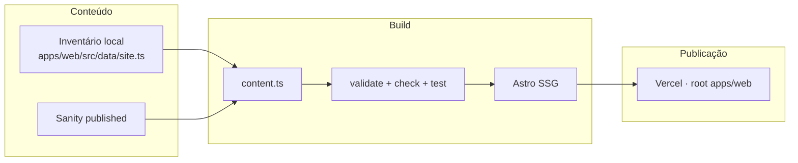

# Náutica Engenharia

**Soluções em engenharia para operações que não podem parar.**

[](https://github.com/RafaelADSdev/Nautica-engenharia/actions/workflows/quality.yml)

Monorepo da reconstrução institucional da [Náutica Engenharia](https://www.nauticaengenharia.com) — empresa de Recife que atende Pernambuco, Alagoas, Ceará, Paraíba e Rio Grande do Norte. O site público sai do Wix e passa a ser estático, versionado e auditável. O conteúdo editorial vive no Sanity, com um inventário local que garante o build mesmo se o CMS falhar.

> Engenharia sólida. Presença regional. Copy, claims e dados de contato só entram em produção depois de revisão.

## O que este repositório entrega

- Site institucional em Astro (SSG), com as 16 URLs da operação: home, 9 frentes de serviço, 4 categorias de cases e 2 páginas legais.
- Painel editorial no Sanity Studio, com seed determinístico a partir do inventário versionado.
- Camada de leitura que consulta o dataset publicado no build e, campo a campo, preserva o valor local quando o remoto falta ou é inválido.
- Pipeline de qualidade que recusa merge e deploy se validação, type-check, testes ou build falharem.



Sem `SANITY_PROJECT_ID`, o frontend valida e publica o inventário local. Com o ID configurado, consulta o dataset durante o build (`useCdn: false`, perspectiva `published`). Rascunhos ficam de fora. Uma falha remota nunca apaga páginas do build.

## Monorepo

```text
nautica-engenharia/
├── apps/web/          Site público — Astro 7, TypeScript, Vitest, Playwright
├── apps/studio/       Sanity Studio — schemas, Vision e seed determinístico
├── docs/              Publicação, previews e Vercel Agent
└── .github/workflows  Quality: conteúdo, check, testes, build e e2e
```

| Pacote | Papel |
| --- | --- |
| `@nautica/web` | Site estático. Root de deploy na Vercel. Output em `dist`. |
| `@nautica/studio` | CMS editorial. Seed, validação de conteúdo e schemas. |

O workspace usa **pnpm 11** e **Node >= 22.12**. O CI roda em Node 24.

## Superfície pública

Nove frentes de serviço, quatro vitrines de cases e as páginas legais exigidas no corte do Wix:

| Rota | Tipo |
| --- | --- |
| `/` | Home institucional |
| `/recuperacao-e-reforco-estrutural` | Serviço |
| `/impermeabilizacao` | Serviço |
| `/trabalhos-em-altura` | Serviço |
| `/obras` | Serviço |
| `/instalacao-predial-e-industrial` | Serviço |
| `/estrutura-metalica` | Serviço |
| `/sistemas-de-seguranca` | Serviço |
| `/terceirizacao-mao-de-obra` | Serviço |
| `/laudos-e-projetos` | Serviço |
| `/cases-condominios` | Cases |
| `/cases-hospitais` | Cases |
| `/cases-industria` | Cases |
| `/cases-varejo` | Cases |
| `/terms-and-conditions` | Legal |
| `/privacy-policy` | Legal |

A home concentra equipe, cobertura regional, parceiros e o CTA comercial no WhatsApp. Contatos, endereço e claims legais moram em `apps/web/src/data/site.ts` e são área sensível: altere com revisão.

## Começar a desenvolver

```bash
pnpm install
pnpm dev
```

O site sobe em `http://localhost:4321`. Para o Studio:

```bash
pnpm --filter @nautica/studio dev
```

Copie os `.env.example` para `.env` somente quando houver credenciais. Sem elas, o site usa o fallback local e o Studio não aponta para um projeto remoto.

| Arquivo | Quando preencher |
| --- | --- |
| `apps/web/.env.example` | Build com Sanity. Só `SANITY_PROJECT_ID`, `SANITY_DATASET` e `SANITY_API_VERSION`. |
| `apps/studio/.env.example` | Studio local e seed. Token de escrita nunca entra no site. |

Não prefixe o project ID com `PUBLIC_`. A leitura de documentos publicados não usa `SANITY_AUTH_TOKEN`.

## Comandos

Rodar sempre na raiz do monorepo.

| Comando | O que faz |
| --- | --- |
| `pnpm install` | Instala o workspace com lockfile. |
| `pnpm dev` | Sobe o site (`@nautica/web`). |
| `pnpm --filter @nautica/studio dev` | Sobe o Sanity Studio. |
| `pnpm content:validate` | Preflight do seed: contagens, slugs, galerias e arquivos. Não altera o Sanity. |
| `pnpm check` | Type-check do site e do Studio. |
| `pnpm test` | Testes unitários (inventário editorial e validação). |
| `pnpm test:e2e` | Build + Playwright + axe (rotas, SEO, teclado, overflow). |
| `pnpm build` | Gera o site estático em `apps/web/dist`. |
| `pnpm validate` | `content:validate` + `check` + `test` + `build`. Porta de entrada antes de um PR. |
| `pnpm sanity:seed` | Envia imagens e grava documentos com IDs determinísticos. |

### Imagens locais

Originais ficam em `apps/web/public/assets` para importação no Sanity. Depois de trocar foto ou logo, rode:

```bash
pnpm --filter @nautica/web assets:optimize
```

O script gera derivações WebP em `public/assets/optimized`. O frontend entrega 320, 640, 960 ou 1600 px via `srcset`. Versione as derivações junto com os originais.

## Qualidade antes do merge

Nada entra em `main` no escuro.

1. `pnpm validate` no seu ambiente.
2. Workflow **Quality** verde no GitHub Actions — o mesmo conjunto do validate, mais e2e com Chromium e axe.
3. Preview da Vercel revisado no PR.

O build de produção na Vercel repete validação, check, testes unitários e build (`apps/web/vercel.json`). Se alguma etapa falhar, o último deploy saudável permanece no ar.

## Publicação

- **Produção:** branch `main`, root `apps/web`, output `dist`.
- **Domínio:** `www.nauticaengenharia.com` como principal; `nauticaengenharia.com` redireciona em permanente. DNS só depois da aprovação do preview final.
- **Variáveis de build** (Production, Preview e Development):
  - `SANITY_PROJECT_ID` — ID público do projeto Sanity
  - `SANITY_DATASET` — normalmente `production`
  - `SANITY_API_VERSION` — `2026-08-01` (fixa, para builds reproduzíveis)

Pull requests geram preview e não tocam produção. Checklist de corte, rollback e webhook estão em [`docs/DEPLOYMENT.md`](docs/DEPLOYMENT.md). Configuração do Vercel Agent em [`docs/vercel-agent.md`](docs/vercel-agent.md).

### Sanity: importação inicial

1. Copie `apps/studio/.env.example` para `apps/studio/.env` e preencha localmente.
2. Use um token de Editor somente em `SANITY_AUTH_TOKEN`. Informe `SANITY_LEGAL_REVIEWED_AT` depois da aprovação jurídica (`AAAA-MM-DD`).
3. `pnpm content:validate` — preflight, sem escrever no CMS.
4. `pnpm sanity:seed` — imagens + documentos com IDs determinísticos.
5. Revogue o token temporário ou remova-o do ambiente ao terminar.

O seed exige `--apply` (já incluso em `sanity:seed`), usa `createOrReplace` e **não apaga** documentos extras. Pode ser repetido na migração, mas sobrescreve os IDs gerenciados: `service.*`, `case.*`, `partner.*`, `team.*`, `legal.*`, `siteSettings` e `homePage`.

### Rebuild depois de publicar no CMS

1. Na Vercel, crie um Deploy Hook apontando para `main`. Dê a ele um nome que não revele o endereço.
2. No Sanity Manage, crie um webhook para `create`, `update` e `delete`, filtrado aos tipos editoriais, com a URL completa do hook como destino `POST`.
3. Trate a URL como credencial. Não a coloque em `.env` público, código, issue, log ou documentação compartilhada.
4. Publique uma alteração de teste e confirme que o deploy novo passou em validação, testes e build.
5. Se a URL vazar, exclua o hook na Vercel e gere outro. Somente o hook de `main` deve estar cadastrado no Sanity.

Filtro sugerido:

```text
_type in ["siteSettings", "homePage", "service", "caseStudy", "partner", "teamMember", "legalPage"]
```

O filtro operacional completo — excluindo rascunhos — está em [`docs/DEPLOYMENT.md`](docs/DEPLOYMENT.md).

## Onde mexer com cuidado

| Área | Por quê |
| --- | --- |
| `apps/web/src/lib/content.ts` | Leitura Sanity + fallback local. Uma regressão aqui derruba o contrato do build. |
| `apps/studio/scripts/seed.ts` | Seed determinístico. Revisão obrigatória antes de `--apply`. |
| `apps/web/src/data/site.ts` | Claims, WhatsApp, telefones, endereço e copy institucional. |
| `apps/web/src/data/types.ts` | Contrato compartilhado entre frontend, validação e Studio. |

Tokens, `.env` e URLs de Deploy Hook não entram no repositório.

## Documentação

| Documento | Assunto |
| --- | --- |
| [`AGENTS.md`](AGENTS.md) | Convenções para quem (ou o que) edita o código. |
| [`docs/DEPLOYMENT.md`](docs/DEPLOYMENT.md) | Vercel, webhook do Sanity, corte do Wix e rollback. |
| [`docs/vercel-agent.md`](docs/vercel-agent.md) | Code review e investigation no dashboard da Vercel. |

---

Náutica Engenharia & Serviços · Recife, PE · [www.nauticaengenharia.com](https://www.nauticaengenharia.com)
